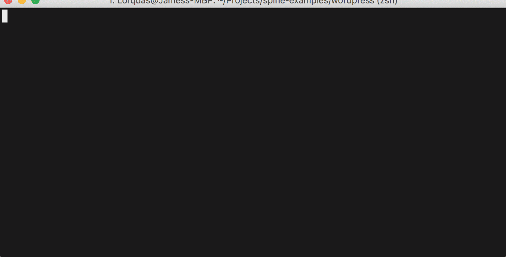

Spine Examples
==============



Looking to get started with [Spine](https://spi.ne)?

This repo will get you up and running in just a few minutes.

What is Spine?
--------------

Spine helps people build awesome things by putting a cloud-native platform within reach
of a click.

The container ecosystem is more popular today than it's ever been, but it remains
difficult to scale from a single container to a fully-fledged web service which can
satisfy the demands of the modern Internet. We think that it's time to simplify the
container scaling and deployment experience, so we've built the industry's most powerful
and easy-to-use platform for hosting containerized applications.

Spine is currently an invitation-only service. Please sign up for the alpha at
https://spi.ne/ to receive your installation instructions.

How Spine Works
---------------

Every Internet application requires the same fundamental building blocks:
**compute resources**, **data storage**, **load balancing**, and a way to
**connect everything together**.

Spine provides these building blocks within its four core services: **Clusters**,
**Volumes**, **Balancers**, and **Synapses**.

### Clusters

Clusters are Spine's core offering: powerful compute resources for running Docker
containers. Each Cluster is sold by the **Nerve**, which is a discrete bundle of compute
resources: CPUs and RAM:

| Nerve Type | CPUs | RAM (mb) | Monthly Price |
|------------|------|----------|---------------|
| **Toaster** | 1 | 256 | $5 |
| **Mini** | 1 | 768 | $10 |
| **Developer** | 1 | 1792 | $20 |
| **Small** | 2 | 3000 | $40 |
| **Medium** | 2 | 7936 | $80 |
| **Large** | 4 | 16128 | $160 |

Simply tell us which container you'd like us to run and how much power you need and we'll
handle the rest:

```yaml
clusters:
  - rocketchat:
      image: rocket.chat
      nerve_type: small
      nerves: 5
      ports:
        - port: 3000
```

### Volumes

Volumes provide high-performance, encrypted SSD storage which can be mounted into any
Docker container. Volumes are automatically backed up and can be restored with a single
command, making it easy to handle persistent data, whether you're just starting out or
have a need for terabytes of reliable, performant storage.

This snippet will create a 1 terabyte [Mongo](https://www.mongodb.com/) cluster, suitable
for an extremely demanding application:

```yaml
clusters:
  - mongo:
      image: mongo
      nerve_type: large
      volumes:
        - mount_location: /data/db
          size_gb: 1024
      ports:
        - port: 27017
```

### Synapses

The more microservices you run, the more complex it becomes to maintain reliable
communications between them. Synapses make it easy to solve this painful issue and are
based upon advanced routing technologies such as
[Finagle](https://twitter.github.io/finagle/).

This snippet uses a Synapse to connect the [Rocket Chat](https://rocket.chat/) cluster we
created above to our giant Mongo database, powered by a Volume.

```yaml
clusters:
  - rocketchat:
      image: rocket.chat
      nerve_type: small
      nerves: 5
      synapses:
        - resource: mongo
          port: 27017
      ports:
        - port: 3000
```

### Balancers

Balancers connect your applications running within Spine to the outside Internet. They
provide static IPs for ease of connection, SSL termination, and a complimentary spi.ne
subdomain for ease of use.

This snippet will create a public HTTPS endpoint for the Rocket Chat cluster we created
above:

```yaml
balancers:
  - rocket:
      enable_ssl: true
      redirect_to_https: true
      synapses:
        - resource: rocketchat
          protocol: https
          remote_port: 3000
```

Launching the Examples
----------------------

Each directory contains a **Backbone** file which will spin up a demo application. They
can all be launched with a single command:

```bash
$ cd <service>
$ spine deploy
```

For example, let's deploy an Etherpad collaborative text editor:

```
$ cd etherpad
$ spine deploy
 - Deploying Cluster: etherpad
 - Deploying Cluster: ep-mariadb
 - Deploying Balancer: etherpad
balancers:
- etherpad:
    datacenter: us-east-1
    name: etherpad
    nerves: 1
    nerve_type: mini
    public_ips:
    - 34.193.135.170
    synapses:
    - port: "80"
      protocol: http
      remote_port: "9001"
      resource: etherpad
      type: cluster
...
```

Using Your New Application
--------------------------

Once you've deployed, your application will be available at the following URL:

```http://<balancer name>-<your subdomain>.spi.ne```

To find your subdomain, simply run ```spine user info```:

```
$ spine user info
email: phil@collins.com
name: philcollins
subdomain: demo

$ open http://etherpad-demo.spi.ne
```

Digging Deeper
--------------

Once you've launched an application on Spine, you can check the running status of any one
of its containers by using the ```spine cluster status``` command:

```
# spine cluster status etherpad
status: RUNNING
nerves:
  0:
    status: RUNNING
    when: 5 seconds ago
    host: drone-f805a661.us-east-1.spine.hosting
    failure_count: 0
```

If you'd like to take a look at the container logs, use the ```spine cluster logs``` command:

```
# spine cluster logs etherpad
0 - 2017-03-21T02:44:27.508Z: Started Etherpad...
0 - 2017-03-21T02:44:27.709Z: [2017-03-21 02:44:27.705] [WARN] console - Declaring the sessionKey in the settings.json is deprecated. This value is auto-generated now. Please remove the setting from the file.
0 - 2017-03-21T02:44:28.945Z: [2017-03-21 02:44:28.937] [INFO] console - Installed plugins:
0 - 2017-03-21T02:44:28.962Z: [2017-03-21 02:44:28.952] [WARN] console - Can't get git version for server header
0 - 2017-03-21T02:44:28.963Z: [2017-03-21 02:44:28.952] [INFO] console - Report bugs at https://github.com/ether/etherpad-lite/issues
```

Finally, if you'd like to hop on a container's root console, use the ```spine cluster ssh``` command:

```
# spine cluster ssh etherpad
             _)
  __|  __ \   |     __ \    _ \
\__ \  |   |  |     |   |   __/
____/  .__/  _| _) _|  _| \___|
      _|
-------------------------------
Cluster: etherpad
Nerve: 0
Owner: philcollins
-------------------------------
root@drone-f805a661:/opt/etherpad-lite#
```

Need help?
----------

If you run into any issues, we're here to ensure that you have a great experience with Spine.

Come join our support Slack and we'd be glad to help you out:

https://support.spi.ne

<p align="center">
  
</p>
